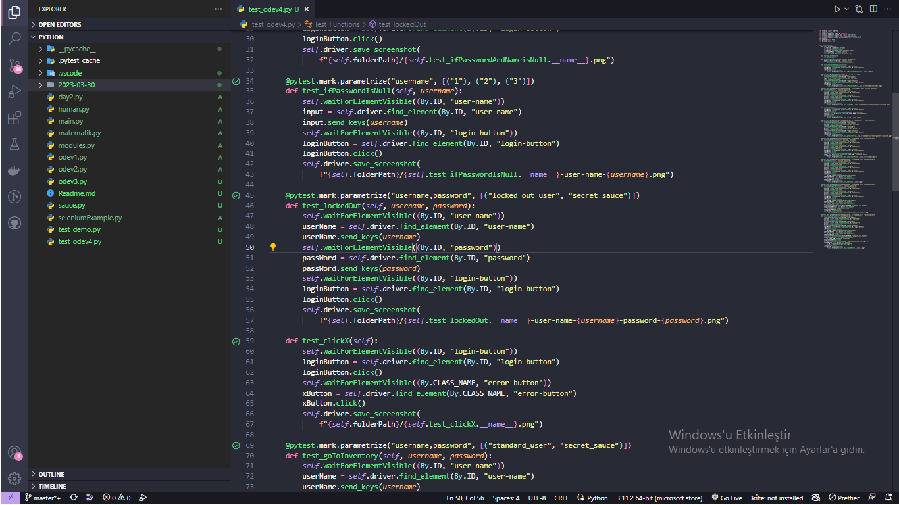

pytest.fixture() Fixtur fonksiyonlarının parametrelendirilmesine izin verir .

@pytest.mark.parametrize() test işlevinde veya sınıfta birden çok bağımsız değişken ve bağlantı kümesi tanımlamaya izin verir.

@pytest.mark.skip() tarafından sağlanan ve test işlevlerinin yürütülmesini atlamak için kullanılan böyle bir belirteçtir.

@pytest.mark.xfail() Bir testin olduğunu belirtmek için dekoratör kullanabilirsiniz expected to fail. Her zaman olduğu gibi, işaret dekoratörünü test işlevine veya yöntemine uyguluyoruz

@pytest.mark.timeout() Varsayılan olarak, eklenti herhangi bir testi zaman aşımına uğratmaz, eklentinin uzun süren testleri kesmesi için geçerli bir zaman aşımı belirtmeniz gerekir. Bir zaman aşımı her zaman bir saniye sayısı olarak belirtilir ve düşük öncelikten yüksek önceliğe kadar çeşitli şekillerde tanımlanabilir.

